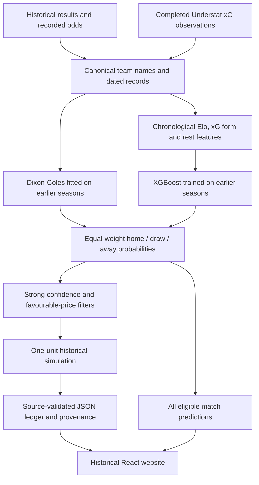

# The Football Experiment — article writer’s handoff

Prepared: 6 October 2026; updated after the public-readiness review. This document describes the current implementation and committed website snapshot. It is a factual reference for writing an article, rather than a replacement article.

## 1. The project in one paragraph

The Football Experiment is an open-source football prediction and historical betting simulation project. Its Python pipeline combines a Dixon–Coles goals model and an XGBoost classifier, with Elo ratings and observed expected-goals form among the classifier’s inputs. It covers the Premier League, La Liga, Bundesliga, Serie A and Ligue 1. The website makes the experiment inspectable: visitors can explore historical selections, results, odds, simulated returns, model probabilities and source provenance. Its central finding is that a high hit rate on strong predictions did not translate into a profitable selected-bet simulation.

- Website: https://betting.keabetswe.online
- Code: https://github.com/keammakola/Football-Predictor
- Author’s portfolio: https://keabetswe.online
- Code licence: MIT, copyright 2026 keammakola.
- Current product name: **The Football Experiment**.
- Current website headline: **“My Prediction Bot Won More Often Than It Lost. The Backtest Still Lost Money.”**

The author originally set out to explore whether programming and football modelling could beat bookmakers. Personal details such as how many weeks the work took should be confirmed with the author; they cannot be established from the exported results.

## 2. What readers should understand immediately

There are two different populations in the story:

1. **Strong predictions:** the model’s highest-probability outcome is at least 60%, with a lead of at least 25 percentage points over its second choice. This group does not require favourable odds.
2. **Selected simulated bets:** strong predictions that also pass the price filter. The recorded bookmaker odds must exceed the model’s break-even odds.

The published headline statistic for the first group is **69.2%**. The selected-bet ledger’s hit rate is **59.5%**. Do not say that 69.3% of the 925 simulated bets won.

“Nearly 70% of my strong predictions were right, but the selected betting simulation still lost money” is a defensible framing, provided both groups are explained. Use **hit rate**, rather than “conversion rate.” This is not evidence of 70% accuracy across every match, probability calibration, or a 70% future success guarantee.

## 3. Current published results

The ledger provenance records export time **2026-10-06T13:46:08.647622+00:00**.

| Measure | Published snapshot |
| --- | ---: |
| Exported match predictions | 9,157 |
| Selected simulated bets | 925 |
| Winning selected bets | 550 |
| Losing selected bets | 375 |
| Selected-bet hit rate | 59.46%, displayed as 59.5% |
| Strong-prediction headline hit rate | 69.2% (1,502 of 2,169) |
| Stake per selection | 1 unit |
| Total stakes | 925 units |
| Total returned, including winning stakes | 877.37 units |
| Net simulated profit/loss | −47.63 units |
| Return on stakes | −5.149%, displayed as −5.1% |
| Selected ledger dates | 7 August 2021–20 September 2026 |
| Prediction export dates | 6 August 2021–20 September 2026 |
| Season labels | 2021/22–2026/27; final season partial |
| Historical result/odds files represented in ledger provenance | 30 |

A unit is an abstract stake, not a rand amount. The simulation does not establish a real-money trading history, initial bankroll, compounding strategy or monetary loss by the author.

### Results by league

| League | Bets | Wins | Hit rate | Net units | ROI |
| --- | ---: | ---: | ---: | ---: | ---: |
| Bundesliga | 108 | 66 | 61.11% | −0.45 | −0.42% |
| Premier League | 193 | 104 | 53.89% | −26.22 | −13.59% |
| La Liga | 257 | 168 | 65.37% | +6.52 | +2.54% |
| Ligue 1 | 124 | 73 | 58.87% | −7.23 | −5.83% |
| Serie A | 243 | 139 | 57.20% | −20.25 | −8.33% |

### Results by season

| Season | Bets | Wins | Hit rate | Net units | ROI |
| --- | ---: | ---: | ---: | ---: | ---: |
| 2021/22 | 203 | 120 | 59.11% | −12.50 | −6.16% |
| 2022/23 | 224 | 143 | 63.84% | +6.31 | +2.82% |
| 2023/24 | 158 | 89 | 56.33% | −14.03 | −8.88% |
| 2024/25 | 196 | 114 | 58.16% | −16.74 | −8.54% |
| 2025/26 | 132 | 74 | 56.06% | −13.63 | −10.33% |
| 2026/27, partial | 12 | 10 | 83.33% | +2.96 | +24.67% |

The final row has only 12 bets. Its apparent performance is too small a sample to support a robust conclusion. La Liga and some seasons were profitable in this snapshot; avoid saying that every league or every period lost money.

### Snapshot precision and reproducibility

The public JSON rounds probabilities to three decimal places. Applying the stated
strong thresholds gives 2,169 predictions and 1,502 correct outcomes: 69.2485%,
now displayed as **69.2%**. The original 69.3% headline was generated from a
full-precision run whose exact denominator was not preserved. This revision makes
the published figure independently reproducible; the 925-bet ledger and returns
are unchanged. The published article currently uses the earlier 69.3% figure.

The former root CSVs contained 9,158 predictions and 926 bets, with other values
also differing from the frozen snapshot. They have been moved to the labelled
research archive and are not the original full-precision run. A new run uses
model 2.0, keeps full-precision predictions and records inputs, code, environment
and counts in a hash-linked run manifest. See `docs/snapshot.md`.

## 4. Data sources and what is actually observed

### Results and odds: football-data.co.uk

Historical season CSVs provide teams, dates, full-time scores, full-time outcomes and recorded bookmaker odds. The five league codes are E0, SP1, D1, I1 and F1.

Example source: https://www.football-data.co.uk/mmz4281/2122/E0.csv

The betting simulation uses **Bet365 1X2 columns `B365H`, `B365D`, `B365A`**. These are recorded historical prices. Do not describe them as guaranteed executable prices or verified closing prices: the code does not establish those claims. Other utility code can use additional odds columns, but that does not change the selected ledger’s price source.

### Expected goals: Understat

The collector requests Understat’s league-season JSON, retains completed matches with finite, nonnegative home and away xG, and stores source URLs and Understat match identifiers.

| League | Observed xG match records in source manifests | Public source |
| --- | ---: | --- |
| Bundesliga | 3,402 | https://understat.com/league/Bundesliga/2026 |
| Premier League | 4,230 | https://understat.com/league/EPL/2026 |
| La Liga | 4,249 | https://understat.com/league/La_liga/2026 |
| Ligue 1 | 3,902 | https://understat.com/league/Ligue_1/2026 |
| Serie A | 4,230 | https://understat.com/league/Serie_A/2026 |
| **Total** | **20,013** | |

These counts describe historical input observations across multiple seasons, not the number of selected bets. The linked pages show the named season; manifests contain the complete collection’s season URLs.

xG is a provider’s statistical estimate of chance quality. “Observed xG” here means a real provider observation attached to a completed match, not that xG itself is a directly measured physical quantity or ground truth.

### The xG collector repair

An earlier collector generated placeholder values. The current collector removes that fallback and rejects synthetic/legacy caches, malformed responses, missing or invalid xG, duplicates and invalid source metadata. A failed refresh preserves the previous cache rather than inventing data. Cache files have SHA-256 manifests, and training checks their integrity.

Source date discrepancies are handled by matching a unique home/away fixture within a season to the result-source date. The original Understat date is preserved. Unmatched observations are flagged and excluded from form history.

The stored coverage report contains 20,012 matched observations out of 20,013 result inputs. The unmatched record is Ligue 1’s Rennes–Paris SG fixture dated 23 August 2026. Coverage is an input-history report, not the size of the published prediction universe.

No synthetic xG fallback supplies the current website. However, some other feature columns are constants or modelling assumptions, described below; do not claim that every column is a measured real-world signal.

### Provenance and validation

`provenance.json` includes source URLs, source-file hashes, ledger hash, xG collection metadata and coverage. Export validation checks match identity, source result, recorded odds, winning status and simulated P&L. It rejects missing or ambiguous source matches and duplicate ledger IDs.

A hash demonstrates integrity relative to the recorded file. It does not independently prove that a provider’s underlying observation is correct. Source validation also does not prove forecast quality.

## 5. How the engine works



### Elo ratings

Elo represents relative team strength. Before each result is processed, the code records the rating difference for that fixture, with a 60-point home adjustment. Ratings update after the result, with a goal-difference multiplier. At season transitions, ratings regress toward the league mean.

The implementation initializes unseen teams at 1,450. A separate configuration constant says 1,500, but the actual Elo implementation’s default is what matters. Update strength and season regression differ by league.

**Why use it:** a compact, chronological summary of team strength that can be updated after each match. Elo is a feature in the classifier; it is not a third independently weighted ensemble model.

### Expected-goals form

For each team, the pipeline calculates xG for and against using a five-match rolling average and an exponentially weighted average with span five. Home and away teams together contribute eight xG features.

The feature lookup uses only observations from dates strictly before the target match. Current-match xG and same-day observations are excluded. Missing history remains missing, which XGBoost can handle, rather than being filled using a future-informed global average.

**Why use it:** chance quality can describe recent attacking and defensive performance beyond the final score. This is a design rationale; the current exports do not establish a quantified improvement caused by adding xG.

### Rest and constant situation columns

Rest is derived from each team’s previous match in the loaded league history, capped at 14 days, with 14 as the unseen-team default. It does not account for every cup or international fixture.

The historical snapshot’s classifier also received `home_travel_fatigue = 0` and `away_travel_fatigue = 1`. These are constant role indicators, not measured travel distances or observed fatigue. They do not vary meaningfully between fixtures.

The historical feature builder generated constant injury scores of 1.0, which were **not included in its ensemble classifier**. Current model 2.0 removes both injury and travel placeholders entirely. The current model should not be described as injury-aware, lineup-aware or as measuring actual travel fatigue.

### Dixon–Coles goals model

The goals model estimates team attack, defence and home advantage, with a correction for dependence in low-scoring outcomes: 0–0, 0–1, 1–0 and 1–1. Older matches receive exponentially decreasing weights. SciPy’s SLSQP optimizer fits the parameters.

For each fixture, a corrected score-probability grid is converted into home-win, draw and away-win probabilities. The default grid includes goals 0 through 9 for each team, then normalizes the truncated distribution. Previously unseen teams use fallback goal-rate assumptions.

**Why use it:** it supplies an interpretable goals-based probability structure and explicitly addresses low-score behaviour. The implementation has a warning path when optimization fails; it can proceed with the returned parameters, so convergence must be checked when reproducing runs.

### XGBoost classifier

The historical classifier predicts the three full-time result classes directly. Its 13 input columns were:

- Elo difference.
- Eight xG form columns: rolling and exponentially weighted xG for/against for each team.
- Home and away rest days.
- The two constant travel-role columns described above.

Current research model 2.0 uses 11 inputs, removing these two constants. It has not replaced the frozen historical predictions.

The backtest uses 100 trees, maximum depth 4, learning rate 0.05, row and column subsampling 0.8, and random seed 42. Class labels are mapped explicitly so probability columns remain aligned with home/draw/away outcomes.

**Why use it:** boosted trees can learn nonlinear relationships between the available features. Those settings describe this experiment; they do not prove optimal tuning.

### Ensemble

For each outcome:

`p_ensemble = 0.5 × p_DixonColes + 0.5 × p_XGBoost`

The three resulting probabilities are normalized to sum to one. Equal weighting combines a structured goals model and a feature-based classifier. The published evidence does not demonstrate that 50/50 is the optimal blend or that it beats either component alone.

## 6. Chronology and evaluation design

The main backtest evaluates each league over season codes 2122 through 2627. For a target season, models train on earlier seasons only. The implementation requires at least 100 training rows.

XGBoost and Dixon–Coles parameters are fitted once for each evaluated season. They are not retrained after every match. Elo, prior xG form and rest features can incorporate earlier completed matches within the evaluation season, because they are constructed chronologically.

Describe this as **season-by-season forward evaluation with chronological features**. “Walk-forward” is acceptable if the article explains the seasonal fitting schedule. Avoid implying a fresh model fit before every fixture.

Only matches with all three finite recorded Bet365 odds greater than 1 enter the exported prediction universe. “All predictions” therefore means all exported eligible matches, not every football match or every result in the source history.

Tests check specific chronological behaviours, including exclusion of current and future outcomes from features. They support those implementation properties; they do not prove that every possible form of research leakage or repeated-experiment selection bias is absent. Retrospective model/threshold choices remain a separate concern.

## 7. Selecting bets and calculating returns

For the highest-probability outcome, let `p` be the model probability and `o` the recorded decimal odds.

A strong prediction requires:

- `p >= 0.60`.
- A lead of at least `0.25` over the second-highest outcome probability.

The backtest selects it only when:

`o > 1 / p`

Equivalently, the model-estimated expected net return `p × o − 1` is positive. This is **estimated value according to the model**, not proof of a genuinely profitable opportunity.

The current research and export code share an inclusive 60% boundary and a 25-point lead rule. Rounded historical probabilities cannot reconstruct every original full-precision selection decision.

Each selected bet stakes one unit. A win produces net `o − 1`; a loss produces `−1`. Overall ROI is total net P&L divided by total staked units.

The simulation does not include Kelly staking, compounding, transaction costs, account limitations, price movement, liquidity constraints or proof that the historical prices were available at the prediction time. Those omissions matter when discussing real-world deployment.

### A simple pricing example

At a true success probability of 62% and decimal odds of 1.50:

`expected net return = 0.62 × 1.50 − 1 = −0.07`

That is an expected loss of seven units per 100 units staked, despite winning most bets. Break-even odds are approximately 1.613. At 1.70, the same probability would imply a positive expected return of 0.054 per unit. The probability must be correct for either calculation to describe reality.

### What overround does and does not prove

For decimal odds 1.60, 4.20 and 5.50, the reciprocal probabilities sum to approximately 104.49%. The excess above 100% is the market’s overround.

Dividing each reciprocal probability by that total gives approximately 59.81%, 22.78% and 17.40%. These are **proportionally normalized market-implied probabilities**, not established true probabilities.

Overround describes a margin in the quoted market. It is not identical to a guaranteed realized bookmaker profit percentage and does not establish negative expected value for every individual selection. The project’s negative backtest alone cannot isolate overround as the cause of the loss.

## 8. What the website shows

### Overview

The landing page explains the finding and displays the published headline figures. Its historical ledger supports league and season filtering, match search, incremental expansion and showing the full ledger. Users can expand a match to inspect its scoreline and home/draw/away probabilities.

Headline totals describe the full published ledger; filtering the table does not redefine those global metrics. Empty search results and failed data loads have distinct states.

### Behind the Model

This page presents the experiment’s evidence and engineering choices: selected-bet confidence groups, league and season breakdowns, cumulative simulated P&L, observed xG sources and counts, provenance and coverage, and downloadable historical data.

A confidence-group chart concerns the selected bets in that chart. It should not be described as demonstrating calibration across the entire prediction universe.

### Navigation and links

The source repository appears in the top navigation. “My Portfolio” links to the author’s portfolio. The article button links to https://keammakola.hashnode.dev/house-always-wins.

The deployed product is historical. It is not a live recommendation feed, an automatic bet-placement tool or a service promising upcoming picks.

## 9. Technology choices and their purpose

| Tool | Role and reason |
| --- | --- |
| Python | Data collection, feature construction, training, simulation and export |
| pandas / NumPy | Tabular history processing and numerical calculations |
| requests | Fetching provider data |
| SciPy | Numerical fitting of Dixon–Coles parameters |
| scikit-learn | Class encoding and evaluation utilities |
| XGBoost | Three-class probability classifier |
| React / TypeScript | Interactive historical presentation with typed application code |
| Vite | Frontend development server and production build |
| Tailwind CSS | Styling the website |
| Oxlint | Frontend static lint checks |
| Docker / Nginx | Build and serve the frontend as a container |
| Vercel | Host the public website and custom domain |
| Git / GitHub | Version control and public source distribution |
| JSON | Portable frozen browser-readable evidence exports |
| SHA-256 | Detect changes to recorded files and exported ledger content |

At handoff time, frontend manifests specify React 19, TypeScript 6, Vite 8 and Tailwind 4. Python dependencies are pinned through `requirements-lock.txt` for the tested Python 3.14.4 Linux environment. Cross-platform numerical equivalence is not guaranteed. Streamlit and older research interfaces remain in the repository but are not the deployed React product.

## 10. Hosting and the backend decision

The original discussion included recurring predictions and backend options. The final product deliberately publishes a fixed historical snapshot.

At runtime, the browser loads committed JSON files. It does not need Python training, Supabase, a database, an odds API key or a scheduled collection job. Python acts as an offline research and publishing pipeline.

The Dockerfiles build the frontend using Node, then serve its output using Nginx. Local Docker Compose exposes the website at port 8080. The Vercel configuration uses the Container framework and `Dockerfile.vercel`. Nginx handles frontend routing, asset caching and missing data-file responses.

GitHub workflow definitions remain for optional research, but recurring schedules were removed and the hosted workflows were disabled. Optional fixture and live-odds scripts are not the active website backend.

This approach avoids an ongoing paid API or database requirement for the current site. It is not a guarantee that third-party hosting or domain registration will remain free indefinitely. New historical data requires intentionally rerunning, reviewing and publishing the pipeline.

## 11. Evidence files and code map

| File | What it establishes |
| --- | --- |
| `frontend/public/data/bets.json` | Published selected ledger, outcomes, source odds, simulated P&L and probabilities |
| `frontend/public/data/predictions-all.json` | Published eligible match predictions and recorded market information |
| `frontend/public/data/stats.json` | Rounded strong-prediction headline statistic |
| `frontend/public/data/provenance.json` | Export time, input links/hashes, ledger integrity and xG metadata |
| `data.py` / `team_names.py` | Results loading and team-name alignment |
| `xg_scraper.py` | Actual xG collection, validation, caching and date alignment |
| `features.py` / `elo.py` | Chronological model inputs |
| `dixon_coles.py` | Goals model fitting and probabilities |
| `backtest.py` | Seasonal fitting, ensemble, selection rules and one-unit simulation |
| `export_bets.py` | Source validation, selected ledger and headline export |
| `export_json.py` | Full prediction JSON export |
| `evaluate.py` | Evaluation utilities, including log loss, Brier score and calibration tables |
| `tests/` | Isolated regression checks |
| `docs/xg-data.md` | Collector and chronology notes |
| `docs/repository-guide.md` | Active and supporting repository components |

All code links can be formed from `https://github.com/keammakola/Football-Predictor/blob/main/` plus the path above.

### Data fields

Selected ledger records include `id`, `date`, `season`, `league`, `match`, `pick`, `prob`, `odds_taken`, `won`, `pnl`, `result`, `scoreline`, `p_home`, `p_draw` and `p_away`. H/D/A mean home win, draw and away win. `won` is 1 or 0.

Full prediction records also include individual team names, market-implied probabilities and three recorded odds. `logged_at_utc` and `kickoff_utc` are null where authentic timestamps are unavailable. The export’s `model_version: "1.0"` identifies the frozen legacy model; its original generation commit is unknown. New model 2.0 runs include exact code and environment metadata.

Do not treat the name `odds_taken` as evidence that a real bet was placed. It is the price used in the historical simulation.

## 12. Running and reproducing the project

### Run the website from its existing exports

```bash
cd frontend
npm ci
npm run dev
```

For a production frontend check:

```bash
npm run lint
npm run build
```

From the repository root, run the container with:

```bash
docker compose up --build -d
```

Then open http://localhost:8080.

### Run the Python checks

Use Python 3.14.4, create a virtual environment and install `requirements.txt`, then run:

```bash
venv/bin/python -m pytest tests -q
venv/bin/python publish_snapshot.py --verify
```

Tests use synthetic fixtures solely to exercise code. Those fixtures are not website data.

### Rebuild research outputs

Work in a separate checkout or preserve the existing snapshot first. Refreshing remote data can change source files and results.

```bash
venv/bin/python xg_scraper.py --league all
OMP_NUM_THREADS=1 OPENBLAS_NUM_THREADS=1 venv/bin/python train_xgb.py --league all
OMP_NUM_THREADS=1 OPENBLAS_NUM_THREADS=1 venv/bin/python backtest.py
venv/bin/python publish_snapshot.py
venv/bin/python publish_snapshot.py --verify
```

Result/odds caches must already exist or be downloaded using the functions in `data.py`. The separate training script supports research artifacts; the backtest itself fits its seasonal models. Do not assume a rerun reproduces the currently published snapshot byte for byte, especially given refreshed provider data, model changes and differences between numerical environments.

The default xG refresh gathers the configured history. Passing a restricted season list replaces a league’s cache with only those requested seasons; it is not an incremental append.

Credentials for optional live tools belong in environment variables or ignored local configuration. They are unnecessary for serving the historical site. MIT licensing covers project code, not automatic permission to redistribute every provider’s dataset under MIT.

## 13. Checks completed during development

The project has tests for observed-only xG collection, invalid-data rejection, failed-refresh cache preservation, source date alignment, chronological feature isolation, Elo chronology, Dixon–Coles likelihood calculations, fixture handling and failure-sensitive publication.

Frontend build and lint checks were completed during the recent site work. Browser checks covered both pages at mobile and desktop widths, filtering, table expansion, keyboard interactions, empty states and load-error recovery. Automated accessibility scans reported no violations in the checked configurations. Those scans do not establish complete accessibility conformance.

The recent frontend dependency audit reported zero findings after the build-tool update. That is a time-specific dependency check, not a security audit of the whole project or its Python dependencies.

These implementation checks do not establish probability calibration, statistically significant profitability, superiority to market forecasts or deployment-ready live execution.

## 14. Findings, uncertainties and next improvements

### What this experiment supports

- Strong predictions can have a high hit rate while the selected betting simulation loses money.
- Price affects profitability independently of how frequently a selection wins.
- Adding a favourable-price filter changes the population being evaluated.
- Publishing the ledger and provenance makes the claimed historical result inspectable.
- Real xG observations and chronology checks improve the integrity of the experiment’s inputs.

### What remains uncertain

The observed drop from strong-prediction hit rate to selected-bet hit rate does not establish its cause. Possible explanations include conditional overconfidence, omitted information, price timing, variation in the selected population and sampling variation. Comparing these explanations would require further analysis.

The project does not demonstrate that the bookmaker market incorporated every relevant fact or was objectively a better calibrated forecaster. To establish that, compare model and market probabilities on the same matches using appropriate scoring rules and uncertainty estimates.

Average confidence matching average hit rate is insufficient to demonstrate calibration. Errors can cancel across confidence groups. Evaluate reliability by probability range, league and selected-bet status, and report sample counts.

The current result is retrospective. There is no authenticated pre-match prediction log proving that these exact forecasts existed before kickoff. Chronological backtesting approximates that discipline but is a different form of evidence.

### Useful future work

1. Completed for new runs: synchronized full-precision exports, counts, policy, environment and hash-linked run metadata.
2. Completed: share the inclusive 60% boundary across modelling and export.
3. Completed for model 2.0: remove constant travel and injury placeholders. Future injury inputs require authentic time-stamped observations.
4. Report calibration, log loss and Brier scores for the full and selected populations, alongside market baselines.
5. Add uncertainty estimates for hit rates and returns that account for dependence where relevant.
6. Record prediction-time odds and timestamps before making live-performance claims.
7. Track optimization convergence and assess component/blend performance through explicit ablation studies.
8. Completed: link the published Hashnode article.

Items explicitly marked completed are implemented; the remaining items are future work.

## 15. Editorial guidance and claim boundaries

| Proposed wording | Assessment / reason |
| --- | --- |
| “Nearly 70% of my strong predictions were right.” | Supported by the published 69.2% headline, with the strong-group definition and precision caveat. |
| “The model won 70% of its bets.” | Incorrect for the current selected ledger: it won 550 of 925, or 59.5%. |
| “Across 925 one-unit simulated bets, it lost 47.63 units.” | Supported by the published ledger. |
| “It was a highly calibrated forecaster.” | Not established by the headline hit rate or matching aggregate averages. |
| “The overround guarantees a loss on every wager.” | Too strong; an individual selection can have positive expected value if its true probability and price justify it. |
| “Normalizing odds reveals the true probabilities.” | Incorrect; it supplies an assumption-based market probability estimate. |
| “Selection bias explains the entire loss.” | A plausible hypothesis, not an identified causal result. |
| “Bookmakers know every injury, motivation and weather variable.” | Unsupported absolute statement. The active model does not ingest those signals. |
| “The house always wins and every bankroll must reach zero.” | Not established by this experiment and too broad as a mathematical claim. |
| “The model used real historical results, odds and provider xG.” | Supported, with source provenance and the constant-feature caveat. |
| “The code is entirely open source.” | Project code is MIT; provider data has separate terms. Avoid applying MIT to third-party data by implication. |
| “The website runs without a scheduled backend.” | Supported for the current historical site. |

### Earlier article figures versus the current website

The author’s original draft reports 68.5% hit rate, average confidence 68.8%, nearly 600 bets, a 19-unit loss and −3.2% ROI over three seasons. Those are different from the current snapshot documented here. They may describe an earlier experiment, but this handoff has not independently established that run’s evidence.

The author has chosen to retain that original article. If its figures remain, identify the earlier run and attach its supporting outputs. Do not combine the old numbers with the new 925-bet ledger or present them as the current website’s results.

A useful article structure is: the original engineering question; how the models and real data fit together; the distinction between strong predictions and selected bets; the actual simulated loss; why pricing and conditional evaluation matter; what the experiment does and does not establish; links to the source and evidence.

Keep personal narrative in the author’s voice. Avoid inventing hours worked, money wagered, exact development chronology or conclusions from measurements that have not been performed.

## 16. Short glossary

- **1X2:** home win, draw or away win at full time.
- **Decimal odds:** total payout per unit stake on a winning selection, including the stake.
- **Hit rate:** fraction of predictions or selections that matched the outcome; always specify the population.
- **Calibration:** agreement between predicted probabilities and observed frequencies across relevant groups.
- **xG:** expected goals, a provider model’s estimate of chance quality.
- **Elo:** sequential relative-strength rating.
- **Dixon–Coles:** goals model with time weighting and low-score dependence correction.
- **Ensemble:** combination of multiple model predictions.
- **Overround:** sum of reciprocal quoted odds minus one for an exhaustive market.
- **Estimated value:** positive expected return calculated using the model’s probabilities, which may be inaccurate.
- **P&L:** profit and loss.
- **ROI:** net return divided by total staked amount in this experiment.
- **Chronological leakage:** use of information unavailable before the prediction being evaluated.
- **Provenance:** records identifying data origins, collection metadata and integrity checks.

## 17. Sources to consult

Primary evidence for project-specific claims is the repository and its public exports:

- https://github.com/keammakola/Football-Predictor
- https://betting.keabetswe.online/data/bets.json
- https://betting.keabetswe.online/data/predictions-all.json
- https://betting.keabetswe.online/data/stats.json
- https://betting.keabetswe.online/data/provenance.json
- https://betting.keabetswe.online/data/run-manifest.json

Provider and technical references:

- football-data.co.uk: https://www.football-data.co.uk/
- Understat: https://understat.com/
- Probability calibration documentation: https://scikit-learn.org/stable/modules/calibration.html

When publishing, identify the snapshot date and retain a copy of the evidence used. The live site may be updated later; the article’s claims should remain tied to the run it describes.
